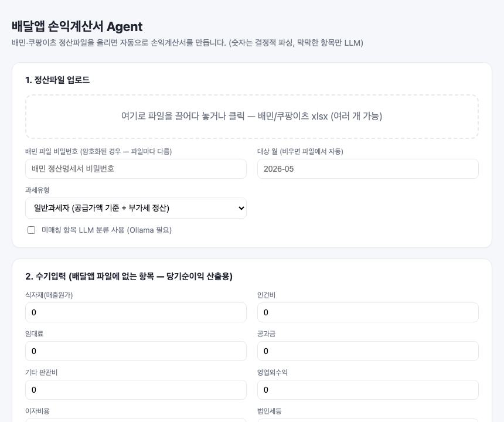
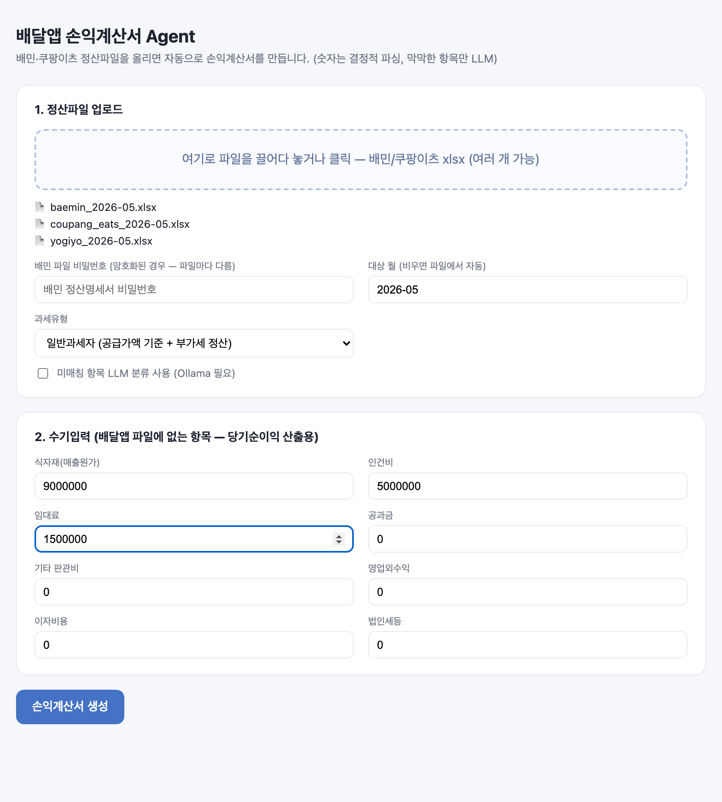
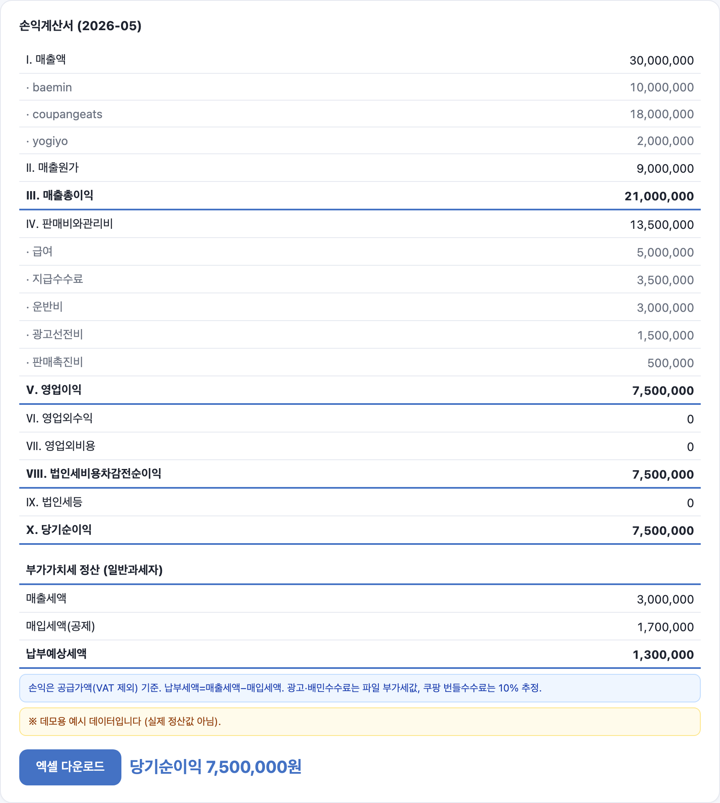

# Korean Delivery-App P&L Agent (baedal-pnl)

[한국어](README.md) · **English**


Upload settlement / sales export files from Korea's major food-delivery platforms
(**배달의민족 Baemin**, **쿠팡이츠 Coupang Eats**, **요기요 Yogiyo**) and the agent
automatically builds an **income statement (down to net income) plus a VAT settlement
by tax type**.

Design philosophy: **numbers come from deterministic code (pandas/openpyxl); only the
fuzzy "what account is this line item?" mapping uses an LLM (local Ollama).**

> References studied: beancount/beangulp (importer skeleton) · smart_importer
> (classification hook) · billcat-local-llm (local-LLM categorization).

## Demo



*(Synthetic demo data — not real settlement values.)*

## Screenshots

| Upload (files + tax type + manual inputs) | Result (income statement + VAT settlement) |
|---|---|
|  |  |

*(Screenshots use synthetic demo numbers, not real data.)*

## Pipeline
Upload → ① detect platform (`identify`) → ② declarative parse (`extract`) →
③ rule-based classification (+ LLM fallback only for unmatched items) →
④ merge across periods/platforms → ⑤ split VAT by tax type → ⑥ income statement + Excel export

## Layout
```
app/
  importers/  base.py · coupangeats.py · baemin.py · yogiyo.py · registry.py
  classify/   rules.py (rules) · llm.py (Ollama fallback) · engine.py (orchestrator)
  manual/     inputs.py (COGS / fixed costs / tax manual entry)
  tax/        vat.py (VAT split by tax type)
  report/     aggregate.py · income_statement.py (structure + Excel render)
  main.py     FastAPI: POST /api/generate
static/index.html  upload UI
run_cli.py    CLI
```

## VAT handling by tax type (`--tax-type general|simplified|exempt`)
VAT is a pass-through, not P&L. Each transaction row declares a `vat_basis`
(gross / supply / exact / none), and **the file's own VAT columns are used first**
(Coupang ads & Baemin "우리가게클릭" = explicit VAT, Baemin fees = supply value,
Coupang bundled fees = 10% estimate).
- **General taxpayer (일반과세자):** P&L at supply value (VAT-excluded); VAT settlement
  (output VAT − input VAT = payable) shown separately.
- **Simplified taxpayer (간이과세자):** P&L at gross; reduced VAT using the 15%
  food-service value-added rate.
- **Tax-exempt (면세사업자):** no VAT, gross basis.
- Sanity identity (holds exactly): `exempt operating profit − general operating profit = general VAT payable`.

## Run
```bash
pip install -r requirements.txt

# CLI
python run_cli.py "coupang.xlsx" --food-cost 6000000 --labor 3500000 --out income_statement.xlsx

# Web (upload UI)
uvicorn app.main:app --reload --port 8077   # http://127.0.0.1:8077
```

## Status
- ✅ **Coupang Eats importer** — verified on a real 2026-05 file.
  `settlement = order amount − service fee (rollup) − ad cost`, zero error.
- ✅ **Baemin importer** — decrypts the password-protected (CDFV2) file via
  `msoffcrypto-tool`, parses the "상세" (detail) sheet. Per-row sum = deposit across
  66 rows, zero error. VAT and pay-on-delivery cash deductions are excluded from P&L.
- ✅ **Baemin + Coupang unified statement.** Since the Baemin password **differs per
  file**, the uploading user enters it in the UI (driven by a `needs_baemin_password` flag).
- ⚠️ **Yogiyo importer** — no real file yet. **Adaptive header-name (synonym) matching**
  + automatic cost-sign detection + **self-reconciliation (sum of items = deposit)**.
  When a real file is dropped in, `ImportResult.notes` reports pass/mismatch immediately;
  if it mismatches, only `yogiyo.py`'s `SYNONYMS` need tuning.
  (`data/_FAKE_yogiyo_sample.xlsx` is fabricated demo data.)
- LLM fallback is optional (`--use-llm` / UI checkbox); without Ollama it safely falls
  back to "기타비용" (misc. expense).

## Known limitations
- Coupang's "service fee" rollup vs. the sum of individual fees differs by ≈0.7% of
  revenue (a **VAT adjustment**). The P&L books individual fees and flags the gap
  against the reported deposit as a warning.
- The Yogiyo importer is not validated against a real file (adaptive matching);
  the built-in reconciliation confirms correctness once a real file arrives.
- VAT figures are for management accounting. For actual tax filing, confirm with an
  accountant / Hometax data.

## License
MIT
